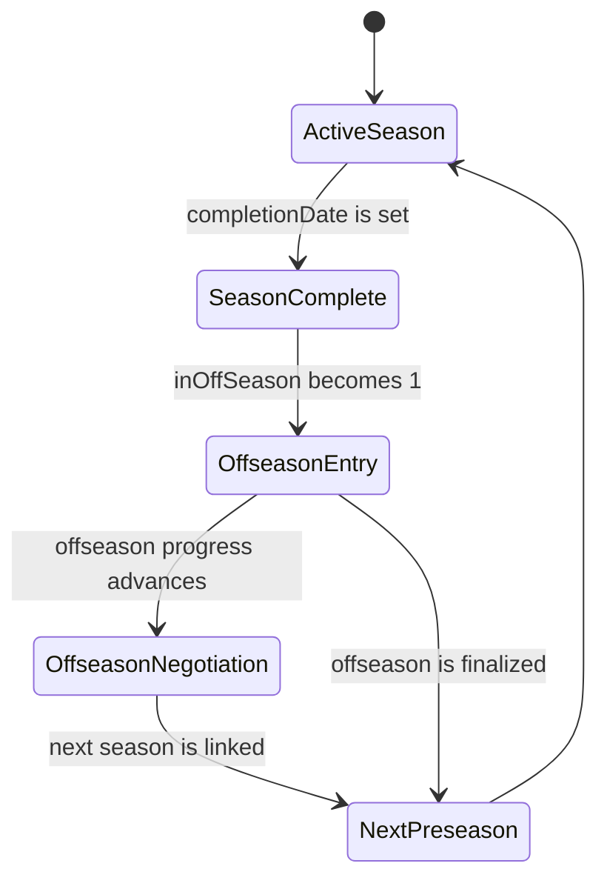

# Franchise Offseason Transitions

## Scope

This document describes how an SMB4 Franchise moves from a completed season through the
offseason and into the next preseason. The important domain behavior is that season identity and
live roster state do not advance at the same time.

During the offseason, the completed season remains the newest linked season while live player and
roster data begins changing for the upcoming season. Consumers of a franchise save must therefore
consider the offseason state in addition to the newest season row.

This lifecycle applies to Franchise Mode. Season Mode has no `t_franchise` row and does not have
the same aging, free-agency, or offseason evolution.

## Lifecycle

The persisted states are:

| State | Newest linked season | `inOffSeason` | `offSeasonTicksCompleted` | Data meaning |
| --- | --- | ---: | ---: | --- |
| Active season | Current season, incomplete | 0 | 0 | Season identity and live roster state describe the same season |
| Season complete | Completed outgoing season | 0 | 0 | Completed-season data is still current; offseason changes have not begun |
| Offseason entry | Completed outgoing season | 1 | 0 | Live player and roster state has begun advancing toward the upcoming season |
| Offseason negotiation/draft | Completed outgoing season | 1 | Greater than 0 | Salaries, availability, teams, and other live state continue changing |
| Next preseason | Newly linked season, incomplete | 0 | 0 | Season identity and live roster state are aligned to the new season |

`completionDate` distinguishes an active season from a completed season, but it does not identify
whether offseason processing has begun. `inOffSeason` is the authoritative marker for the
transitional offseason states.

## Transition details

### Season completion

The current season receives a completion date while `inOffSeason` remains false. The completed
season is still the current franchise season, and its player, team, schedule, playoff, and
statistical state remains internally aligned.

There may be a period between season completion and offseason entry while the franchise resolves
end-of-season decisions. This is still part of the completed-season state.

### Offseason entry

At offseason entry, `inOffSeason` becomes true while the completed season remains the newest linked
season. Live franchise data begins moving forward:

- surviving players age;
- salaries and roster availability can change;
- players move between team and available-player states;
- players selected to retire enter a pending state but remain in the live roster;
- team assignments and other mutable player data can begin reflecting the upcoming roster.

This produces a mixed-time save: the season row identifies the outgoing season, while much of the
live player state belongs to the upcoming season.

### Offseason negotiation and draft

The franchise remains in offseason while `offSeasonTicksCompleted` advances. Each stage can
continue changing salaries, availability, team assignments, and roster composition.

These are real persisted states, not merely an interface screen. Multiple saves taken during the
offseason can therefore contain different upcoming-season roster data while still pointing to the
same completed season.

### Final rollover

Finalizing the offseason creates and links the next season, establishes its initial schedule and
roster state, resets offseason progress, and returns `inOffSeason` to false.

Players pending retirement are removed from the live roster during this transition. Their
historical identity and statistics remain after the active player record is removed.

Only at this boundary do the newest season row and live roster data describe the same new season
again.

## Example transition

Consider a franchise moving from Season N to Season N+1:

| Snapshot | Newest season | `inOffSeason` | Example player age | State |
| --- | --- | ---: | ---: | --- |
| Final pre-offseason snapshot | Season 1 | 0 | 20 | Final Season 1 state |
| Offseason-entry snapshot | Season 1 | 1 | 21 | Offseason started |
| Draft snapshot | Season 1 | 1 | 21 | Draft in progress |
| Next-preseason snapshot | Season 2 | 0 | 21 | Season 2 created |

The middle state is the important one: the save still points to Season 1 while the live roster is
already moving toward Season 2.

## Interpretation

The same save contains two kinds of data with different lifetimes:

- season-specific records describe the linked season;
- live player and roster records describe the franchise's current operational state.

Those lifetimes align during an active season and after final rollover. They diverge during the
offseason.

For any consumer that preserves season history:

- a completed season with `inOffSeason = 0` remains a coherent completed-season source;
- a save with `inOffSeason = 1` is a transitional franchise snapshot whose live roster data should
  not be attributed to the outgoing season;
- a newly linked season with `inOffSeason = 0` establishes the next coherent season boundary.
