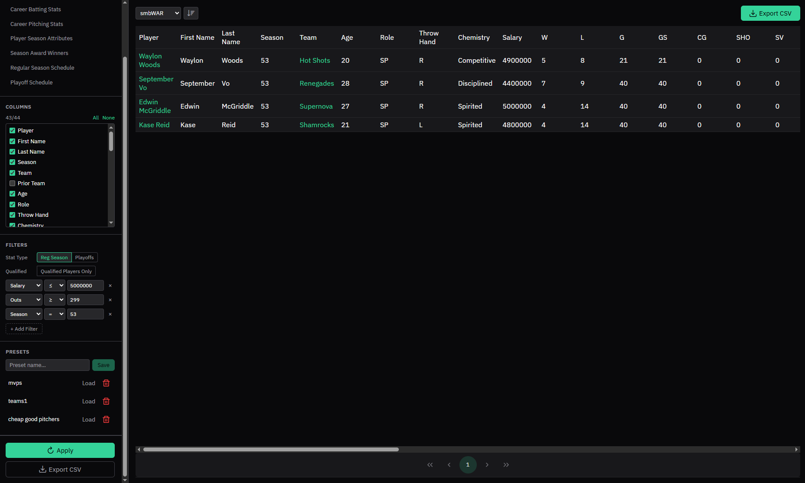

# Stat Explorer

The Stat Explorer lets you pull any slice of your franchise data out as a CSV file — for spreadsheet analysis, sharing with the community, or feeding into other tools.

Open it from the sidebar. The page is split into a configuration panel on the left and a live preview table on the right.

*Stat Explorer page showing sidebar with filters and a preview data grid*

## Datasets

Pick one of nine datasets to query:

| Dataset | What it contains |
|---|---|
| **Player Season Batting** | Per-player batting stats for a single season, including counting stats, rate stats, OPS+, and smbWAR |
| **Player Season Pitching** | Per-player pitching stats for a single season, including ERA, FIP, FIP-, ERA+, and smbWAR |
| **Team Season Standings** | Win-loss records, run differential, playoff results, budget, and payroll by team and season |
| **Career Batting Stats** | Cumulative and rate batting stats across a player's entire franchise career |
| **Career Pitching Stats** | Cumulative and rate pitching stats across a player's entire franchise career |
| **Player Season Attributes** | Per-player ratings (Power, Contact, Speed, Fielding, Arm, Velocity, Junk, Accuracy) captured at end of season |
| **Season Award Winners** | Award winners and runners-up for every season |
| **Regular Season Schedule** | Game-by-game results for every regular season |
| **Playoff Schedule** | Game-by-game results for every playoff series |

## Columns

Toggle individual columns on or off. The CSV export contains exactly the columns you select.

## Preview and Export

Click **Apply** to run the query and see the first page of results in the preview table. When you're ready, **Export CSV** downloads the full result set (all records, not just the current preview page).

## Presets

Save a named preset to store your current configuration. Presets are saved per franchise and persist across sessions.
