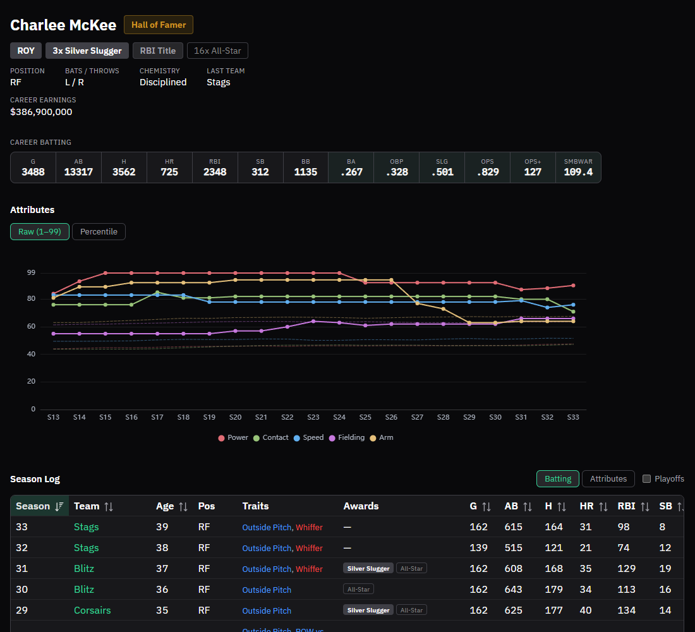
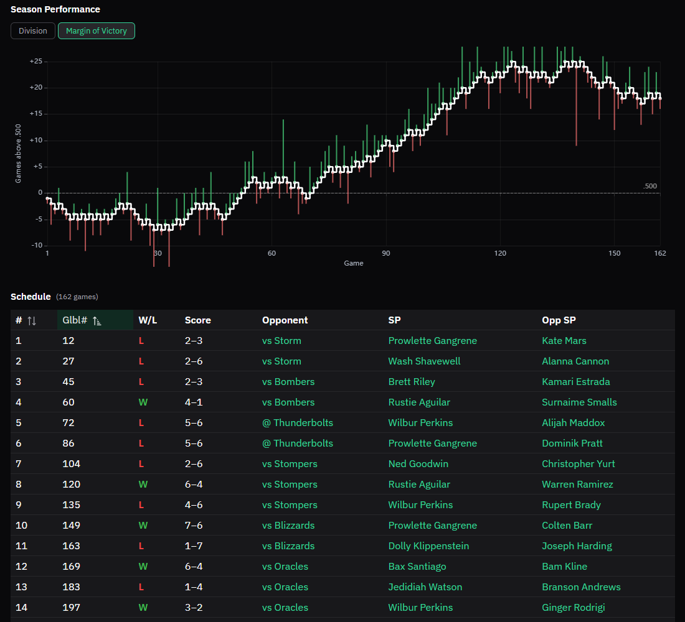

# Getting Started

smb-tools is a franchise history tracker and stat viewer for Super Mega Baseball 4. Think Baseball Reference for the franchise you've been playing, with career leaderboards, season-by-season stat lines, Hall of Fame management, and everything else the in-game screens won't show you.

## Where It Comes From

Two apps came before this one.

**[SMB3Explorer](https://github.com/tbrittain/SMB3Explorer)** was a data extraction tool. Super Mega Baseball's save file holds a lot of per-season stats (batting averages, ERA, player attribute snapshots, schedule results, etc.) that the game itself never surfaces. SMB3Explorer cracked the save file open and dumped all of it to CSV files so players could actually use it.

**[SmbExplorerCompanion](https://github.com/tbrittain/SmbExplorerCompanion)** was the franchise history viewer built on top of those CSV exports. It kept its own database of franchise history across seasons, held onto stats well beyond the game's built-in 50-season limit, and presented everything through a Baseball Reference-style interface.

Together they worked, but the workflow was clunky: run SMB3Explorer to produce CSV exports, import those into SmbExplorerCompanion, then view the stats. Two separate Windows-only apps, both needing the .NET 7 runtime, with a manual multi-step handoff every time you wanted to sync a new season.

smb-tools folds both of these into one. It reads your save file directly, so there's no CSV step and nothing extra to manage in between. Syncing a season is one button click, and it's a lot faster too. The app itself runs on Windows, macOS, and Linux.

::: tip Playing on macOS or Linux?
smb-tools runs natively on all three platforms, but Super Mega Baseball 4 is a Windows/Steam title with no native Mac or Linux release, so where your save file lives and how you point smb-tools at it depends on how you're running the game. See [Finding Your Save File on macOS and Linux](./save-game-setup#finding-your-save-file-on-macos-and-linux) for specifics.
:::

## What It Does

Franchise stat tracking is the core of the app. After a brief first-time setup, you connect smb-tools to your SMB4 franchise save and sync each season as you finish it. The app builds a permanent record of everything the game would otherwise discard: career statistics, season-by-season breakdowns, player development over time, award history, Hall of Fame, and franchise leaderboards going back as far as you've been playing.

*Player career page showing career totals, season-by-season attribute chart, and a full season log with traits and awards.*

*Team detail page showing margin of victory chart across a full 162-game season alongside the complete schedule.*

## A Note on Game Version

smb-tools currently works with **Super Mega Baseball 4** save files. If you tracked your franchise history in SmbExplorerCompanion, you can bring that data forward. See [Importing from SmbExplorerCompanion](./legacy-migration).
